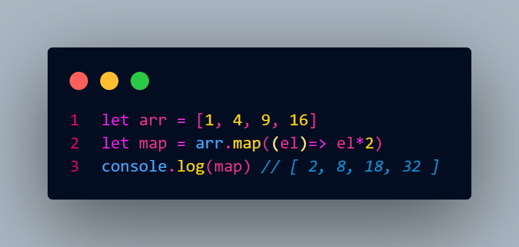

#  Method  
## — block of code that runs only when we call it. It's like a ready-made function
#  Array...
##  Array in JS is object that keeps in itself vals, they can be any type.

##  Array have 18 methods like:

##  Push:
### Push() is a method that adds elements to the end

##  Pop:
### Pop() is a method that removes last element from

##  Unshift:
### Unshift() is a method that adds elements to the start

##  Shift:
### Shift() is a method that deletes first element

##  toString:
### toString() is method that returns array to string

###   And other...
#
#
#  Callback
## A callback is a function that must be executed after another function has finished executing

##  map:
### map() is a CB method that creates a new array and doesn't change the length of it

##  forEach:
### forEach() CB method of array instances executes a provided function once for each array element

##  find:
### find() is a CB method that search the just one element of an array that suits our conditions

##  filter:
### filter() its like find(), but returns every element that suits our conditions

##  reduce:
### reduce() is a CB method that return accumulator

##  toSorted:
### toSorted() is a CB method or upgrated sort() that sorts the array 

##  join() 
### - method of Array instances creates and returns a new string by concatenating all of the elements in this array, separated by commas or a specified separator string

##  flat() 
### -method of Array instances creates a new array with all sub-array elements concatenated into it recursively up to the specified depth

